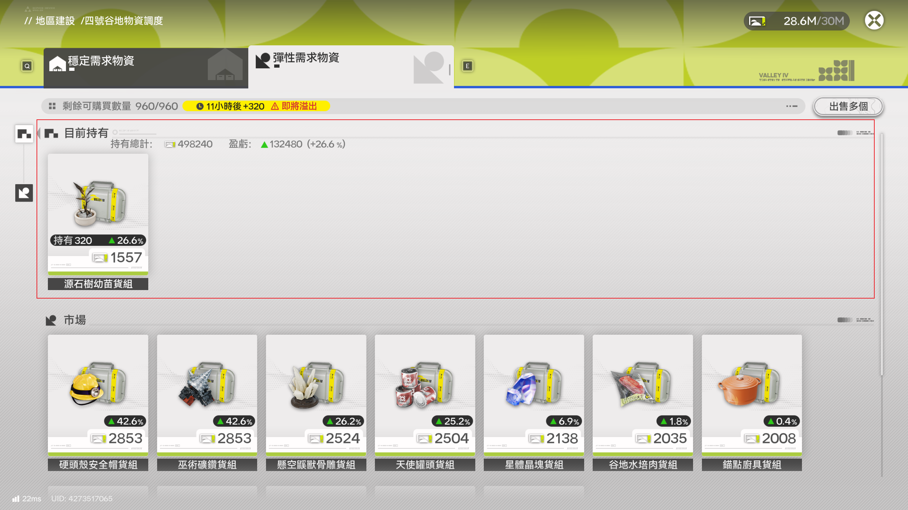
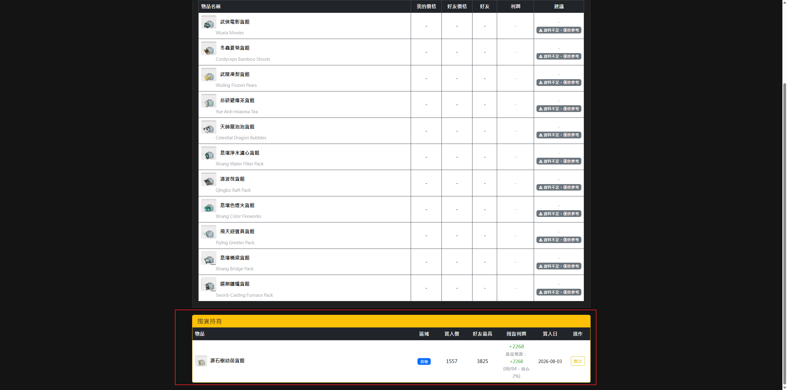

# 終末地 彈性物資價格追蹤器

**明日方舟：終末地 (Arknights: Endfield) 彈性物資市場價格追蹤工具**

自動辨識遊戲畫面中的物品與價格，比對好友市場，一眼找出最賺的交易。

**[⬇ 立即下載](https://github.com/eric25382772/endfield-price-tracker/releases/latest)** ·
[安裝步驟](#安裝步驟) ·
[使用方式](#使用方式) ·
[更新紀錄](CHANGELOG.md)

---

## 目錄

- [功能特色](#功能特色)
- [系統需求](#系統需求)
- [安裝步驟](#安裝步驟)
- [使用方式](#使用方式)
- [注意事項](#注意事項)
- [版本更新紀錄](#版本更新紀錄)

---

## 功能特色

| 功能 | 說明 |
| :--- | :--- |
| **F2 掃描自己的市場** | OCR 自動辨識物品名稱與價格，並偵測目前區域（四號谷地 / 武陵） |
| **F3 掃描好友價格** | 可連續截圖、佇列處理，逐一辨識好友價格列表 |
| **F4 記錄目前持有** | 在物資調度畫面辨識「目前持有」並記錄囤貨 |
| **利潤比對** | 網頁顯示自己價格 vs 好友最高價，計算利潤並給出買入建議 |
| **區域鎖定** | F2 掃完自動鎖定區域，F3 只在該區域內比對物品 |
| **自動更新** | 每次啟動自動檢查並更新到最新版（只抓程式碼、數秒完成），不必再回這裡重新下載安裝程式；網頁導覽列可看到目前版本與更新紀錄 |

---

## 系統需求

| 項目 | 需求 |
| :--- | :--- |
| 作業系統 | Windows 10 / 11 |
| 遊戲解析度 | 建議 2560 x 1440（最低 1920 x 1080） |
| 網路 | 首次啟動需連線下載 OCR 模型 |
| 權限 | 需要管理員權限（監聽全域快捷鍵） |

---

## 安裝步驟

### 步驟 1 — 下載安裝程式

前往 **[Releases](https://github.com/eric25382772/endfield-price-tracker/releases)** 頁面，下載最新版的 `EndfieldTracker_Setup_vX.XX.exe`。

   
  ① 開啟 Releases 頁面，找到最新版本

   
  ② 點擊 <code>EndfieldTracker_Setup_vX.XX.exe</code> 下載

### 步驟 2 — 執行安裝程式

下載完成後雙擊執行。

   
  雙擊下載好的安裝檔

> [!NOTE]
> 若 Windows SmartScreen 跳出警告，點 **「其他資訊」→「仍要執行」** 即可。
> 這是因為安裝程式沒有付費簽章，不是病毒。

<table>
<tr>
<td width="50%" align="center"> ① 點「其他資訊」</td>
<td width="50%" align="center"> ② 點「仍要執行」</td>
</tr>
</table>

### 步驟 3 — 一路「下一步」到完成

安裝精靈全部使用預設值即可，直接按到底。

<table>
<tr>
<td width="50%" align="center"> ①</td>
<td width="50%" align="center"> ②</td>
</tr>
<tr>
<td width="50%" align="center"> ③</td>
<td width="50%" align="center"> ④ 完成</td>
</tr>
</table>

### 步驟 4 — 啟動追蹤器

雙擊桌面的 **「終末地追蹤器」** 捷徑，程式會自動請求管理員權限。

   
  ① 雙擊桌面捷徑

   
  ② 出現權限提示時按「是」

### 步驟 5 — 確認安裝成功

看到「正在開啟網頁」的視窗，就代表安裝成功、程式啟動中。

   
  看到這個視窗就成功了

> [!TIP]
> **首次開啟會比較慢**，因為要載入 OCR 模型，請耐心等候；之後啟動就快了。

---

## 使用方式

### 快捷鍵

| 按鍵 | 功能 | 使用時機 |
| :---: | :--- | :--- |
| **F2** | 掃描自己的市場價格 | 在自己的彈性需求物資畫面 |
| **F3** | 掃描好友的市場價格 | 點開某物資的好友價格畫面 |
| **F4** | 記錄目前持有（囤貨） | 在物資調度畫面 |
| **Ctrl + Shift + Q** | 結束掃描器 | 收工時 |

### 操作流程

> [!IMPORTANT]
> **一定要先按 F2 掃描自己的市場**，系統才知道你在哪個地區，F3 才能正確辨識貨物。

#### 步驟 1 — 開啟追蹤器

雙擊桌面上的「終末地追蹤器」，等它自動打開網頁。

<table>
<tr>
<td width="30%" align="center"> ① 雙擊桌面捷徑</td>
<td width="70%" align="center"> ② 程式啟動中</td>
</tr>
</table>

   
  ③ 出現「正在開啟網頁」

   
  ④ 瀏覽器自動開啟比對頁面

#### 步驟 2 — 按 F2 掃描自己的市場

進入自己的**彈性需求物資**畫面，按 **F2**。系統會自動辨識物品名稱與價格，並帶到對應地區的表格畫面。

   
  ① 在此畫面按 F2

   
  ② 網頁自動帶出該地區的表格

#### 步驟 3 — 按 F3 掃描好友價格

點擊各物資的**好友價格**畫面，按 **F3**。系統會自動辨識並計算出利潤。

> [!TIP]
> **不用等辨識跑完**。F2 還在辨識地區時就可以先按 F3 截圖，F3 辨識途中也可以繼續按 F3 對下一個物資截圖。
> 系統會先把截圖存下來排隊，再依序辨識，不必等前一張跑完。

   
  ① 在好友價格畫面按 F3

<table>
<tr>
<td width="50%" align="center"> ② 辨識中（可繼續按 F3 掃下一個）</td>
<td width="50%" align="center"> ③ 辨識完成，自動算出利潤</td>
</tr>
</table>

#### 步驟 4 — 按 F4 記錄囤貨

跟 F2 是**同一個畫面**：物資調度 →「彈性需求物資」分頁，上半部的**「目前持有」**區就是你囤的貨。在這裡按 **F4**，系統會辨識持有的物資與買入價並記錄下來。

   
  ① 在「目前持有」區按 F4

回網頁重新整理，最下方的**「囤貨持有」**區就會列出持有清單，包含買入價、好友最高價、囤貨利潤與建議賣出日。實際賣掉後按「賣出」把該筆結掉。

   
  ② 網頁最下方出現「囤貨持有」紀錄

> [!NOTE]
> F4 跟 F2 / F3 各自獨立，**不必先按 F2** 也能用，隨時想記錄就按。
> 同一天、同一個物品只會記一筆，重複按不會重複計算。

> [!WARNING]
> 若出現 **「未辨識到『目前持有』」**，代表畫面沒有停在物資調度頁，或是截到了其他視窗。
> 請確認遊戲在最前面、畫面停在物資調度頁，再按一次 F4。

---

## 注意事項

> [!WARNING]
> 按 F2 / F3 / F4 時，**遊戲視窗必須在最前面**，否則會截到其他畫面。

| 項目 | 說明 |
| :--- | :--- |
| **首次啟動較慢** | OCR 引擎首次載入需要下載語言模型，之後會快取在本機 |
| **只支援 Windows** | 掃描器使用 Win32 API 擷取遊戲視窗 |
| **需要管理員權限** | 監聽全域快捷鍵 F2 / F3 / F4 需要管理員權限 |
| **先開追蹤器再開遊戲** | 避免 UAC 提示干擾遊戲 |
| **遊戲要在前景** | 按 F2 / F3 / F4 時，遊戲視窗必須在最前面 |
| **每日重置時間** | 遊戲日期以凌晨 4:00 為分界，4:00 前的操作算前一天 |

---

## 版本更新紀錄

目前 GitHub 上架版本：**v5.1.4**

完整版本歷史詳見 **[CHANGELOG.md](CHANGELOG.md)**。

如果這個工具幫到你，歡迎給一顆 ⭐

